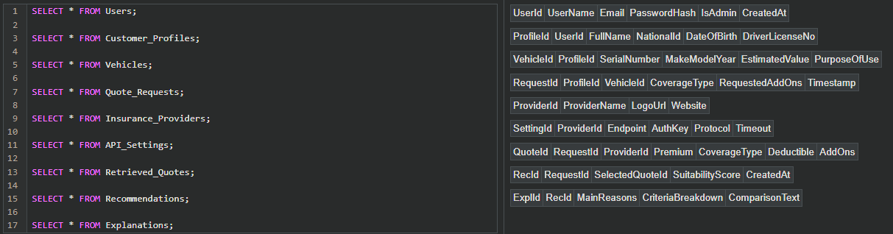
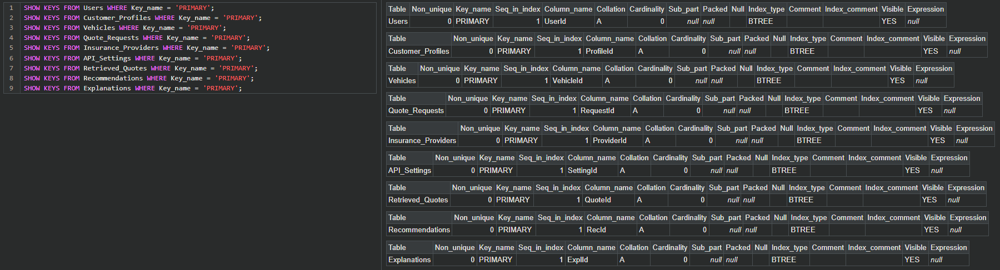
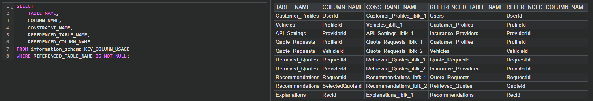

## هيكل المجلدات

```
thiqa_implementation/implementation/
├── agents/                     # خدمة الوكلاء الذكية (Python/FastAPI) — الطبقة 2
│   ├── main.py                 # نقطة الدخول: تطبيق FastAPI + orquestración
│   ├── agent1_receiver.py      # الوكيل 1: الاستلام والجلب
│   ├── agent2_recommender.py   # الوكيل 2: التوصية والترتيب
│   ├── agent3_explainer.py     # الوكيل 3: الشرح والتفسير
│   ├── mock_insurers.py        # طبقة محاكاة شركات التأمين
│   └── requirements.txt        # اعتماديات Python
├── server/                     # خادم Node.js والبوابة — الطبقة 1
│   ├── server.js               # خادم Express مع البوستة الثابتة وتحويل الطلبات
│   ├── package.json            # إعدادات المشروع ونصوص التشغيل
│   └── public/                 # الملفات الثابتة التي يخدمها الخادم
│       └── index.html          # الواجهة الأمامية (متصلة بالخلادم عبر /api/recommend)
├── .gitignore                  # ملفات ومجلدات مستبعدة من git
└── README.md                   # هذا الملف
```






